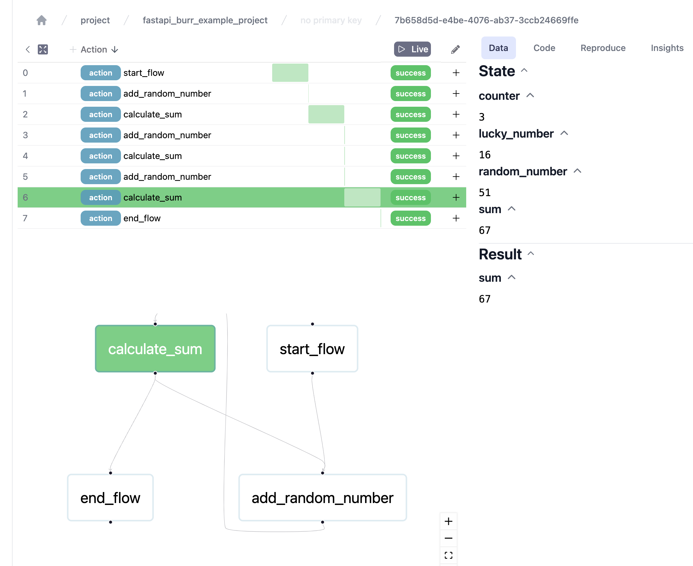

# Burr + FastAPI + Docker Compose Example

- **[Burr](https://burr.dagworks.io/)**: A library modeling your application as a state machine of python constructs, with telemetry and UI for tracing workflows.
- **[FastAPI](https://fastapi.tiangolo.com/)**: A modern, fast (high-performance), web framework for building APIs with Python based on standard Python type hints.

This is a boilerplate configuration of FastAPI and Burr in a docker compose environment, where FastAPI and Burr are running in separate containers with shared burr data. 

This provides a minimal Burr Application with simple actions - enough for demonstrating telemetry between the containers, focusing on the unique configuration of the docker compose environment.

**FastAPI:** This FastAPI configuration is optimized for a docker compose environment, with poetry for package management, and hot reloading in development mode. See `docker-compose.override.yml` for development target hot reloading.



_Runnable example with a cycling action flow._


#### Dev & Prod

- **FastAPI**:
  - The **FastAPI** Dockerfile.api has development and production builds
  - The development build includes hot reloading for fast development
  - The production build does not include hot reloading
- **Burr**:
  - The **Burr container** has not been tested in a production environment, and running it in production in its current form makes telemetry data public because there is no authentication protection.
  - Recommend running this in development environment only.

## Local Dev IDE Setup & Config

The following is to get your local IDE python setup and resolving imports.

This is not required to run the example. See **Running It** below. This is just required for a good development experience.

1. Install Poetry ([Instructions](https://python-poetry.org/docs/#installing-with-pipx))
1. Run `poetry install` in the project root to install all dependencies
1. To resolve imports, activate the poetry environment python interpreter. VSCode instructions:
   1. cmd + shift + p Python: Select Interpreter
   1. Select the correct interpreter - if you cannot find it, go to the next step
   1. Executing this command in your terminal will copy the path to the python interpreter to your clipboard: `poetry env info --path | pbcopy`
   1. You can paste this into the _"Enter Interpreter Path"_ option

## Running The Servers

```bash
# Start the containers
$ docker compose up --build

# Stopping the containers and clearing the volumes (helpful for troubleshooting)
$ docker compose down -v

# Nuke the containers for more troubleshooting
$ docker system prune -a
```

You will see logged messages of the URLs where both the FastAPI and Burr servers are available. 

- Note: The FastAPI server is ready to accept requests from apps / Postman, and is not configured with CORS to handle browser requests.
- Execute the test `GET` request to `http://0.0.0.0:8000/api/?lucky_number=7` to see the flow is logged to Burr's web UI

## Create A Request

Use postman or the following CURL request to test the flow.

```bash
# Send the CURL request with your lucky number
$ curl -X GET "http://0.0.0.0:8000/api/?lucky_number=7"
```

## Docker Compose Explainer

#### Shared Volume

- A shared volume is used between the FastAPI container and the Burr container for burr-data
- In the FastAPI server, a `LocalTrackingClient` is created specifying the storage dir as the burr_path environment variable (set in docker-compose.yml. See [Burr Tracking Docs](https://burr.dagworks.io/reference/tracking/))
- The Burr server also accepts a storage directory path as an environment variable (set in docker-compose.yml. See `LocalBackend` [class comments](https://github.com/DAGWorks-Inc/burr/blob/a1a0b3bcb0f64790615042527c0e173a6c436083/burr/tracking/server/backend.py#L257) for instructions.)
- In `docker-compose.yml` both container's burr_path environment variable is set to the burr-data volume path that both containers are also using.

The burr server automatically updates when the FastAPI server writes new tracking data because they are using the same volume.

#### Dockerfiles

- **Dockerfile.api**: The FastAPI dockerfile configured for burr and poetry requirements, with production and development targets.
- **Dockerfile.burr**: The Burr dockerfile is configured with tini, allowing the burr docker container to properly handle process signals (like shutdown)

#### Host

Hosts for both containers are set to `0.0.0.0` which is optimal for the docker compose setup.